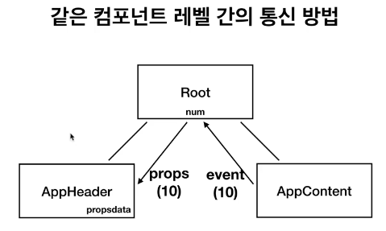

# 컴포넌트 통신 방식 (상위 하위)
- 하위 컴포넌트 -> 상위 컴포넌트 = 이벤트
- 상위 컴포넌트 -> 하위 컴포넌트 = 데이터(Props)
- 
  - 데이터의 흐름방향이 복잡해지고 추적하기 힘듦 
- 
  - 데이터는 항상 내려오고 이벤트는 항상 올라와서 추적하기 쉬움

# 같은 컴포넌트 레벨 간의 통신 방법
- 
  - 상위 컴포넌트를 거쳐서 내려주어야한다
  - event로 데이터를 올리고 props를 이용해서 데이터를 전달하는 방식